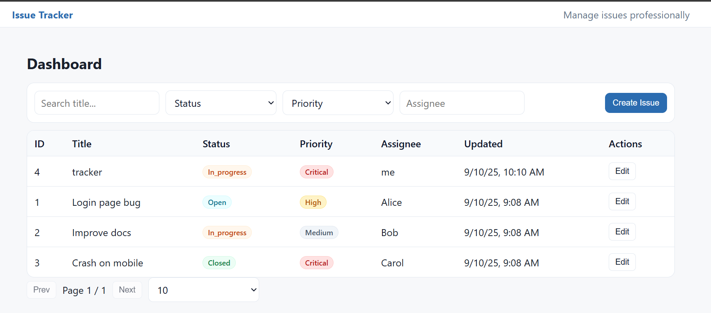
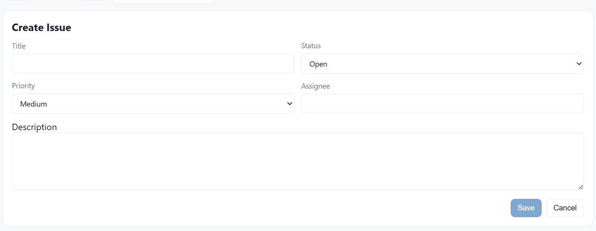
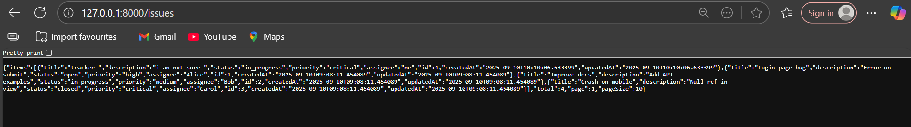

<h1 align="center">🐞 Issue Tracker</h1>
<p align="center">
  A simple and powerful <b>Issue Tracker</b> built using <b>FastAPI(REST API)</b> for the backend and <b>Angular</b> for the frontend.
</p>

---

## 📌 Features

- View, search, filter, and sort issues.
- Create new issues with an easy-to-use form.
- Edit existing issues and track updates.
- Detailed issue view with complete JSON data.
- Responsive and user-friendly UI.

---

## 🛠️ Tech Stack

| **Category**      | **Technology** |
|------------------|----------------|
| Frontend          | Angular, TypeScript, HTML, CSS |
| Backend           | Python (**FastAPI**) |
| API Format        | REST APIs (JSON) |


---

## 🖼️ Screenshots

### 1. Dashboard / Issue List
<p align="center">
  
</p>

### 2. Create New Issue
<p align="center">
  
</p>

### 3. Issue Details / Edit Issue
<p align="center">
  
</p>

### 4. Backend Data JSON
<p align="center">
  
</p>

---

## 📂 Project Structure

```bash
issue-tracker/
├── backend/               # Python REST API backend
│   ├── app.py             # Main backend app
│   ├── requirements.txt   # Backend dependencies
│   └── ...
├── frontend/              # Angular frontend
│   ├── src/
│   ├── package.json
│   └── ...
├── assets/                # Screenshots & project images
│   ├── banner.png
│   ├── dashboard.png
│   ├── create-issue.png
│   ├── issue-details.png
│   └── search-filter.png
└── README.md              # Project README
